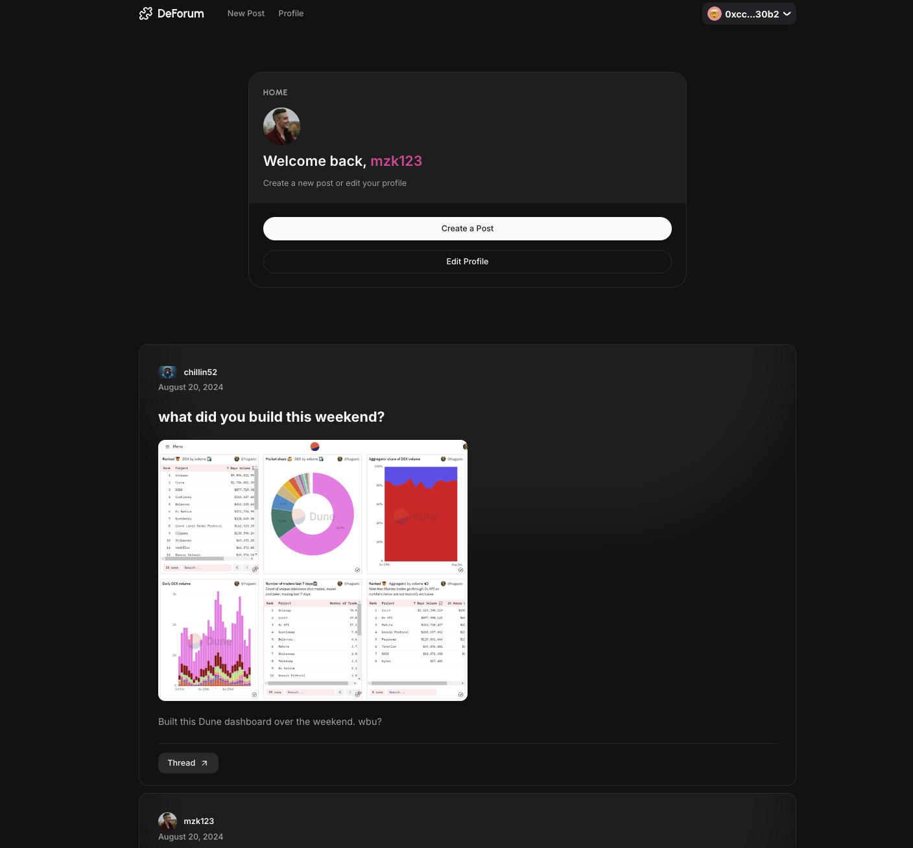

# DeForum - A Web Forum on OrbisDB

A web forum demo application built on OrbisDB and utilising TACo for encrypting posts and managing who has access to them.



## Introduction

This application emulates a web forum, complete with posts, comments, images, and personal profiles. It relies on the following items:

**OrbisDB on Ceramic** - A decentralized database to hold the various forum artifacts users create (such as posts, comments, etc.)
**TACo** - A protocol for secure, end-to-end encrypted data sharing and communication, enabling encryption and decryption of data based on access control logic.
**ThirdWeb SDK** - Uses their IPFS upload feature for image file storage

## Installation

First, create a local clone of the application:

```bash
git clone https://github.com/nucypher/taco-orbisdb-demo && cd taco-orbisdb-demo
```

Next, install your dependencies:

```bash
nvm use 20
pnpm install
```

### Environment Setup

You will need to create a copy of the example environment file:

```bash
cp .env.example .env.local
```

**ThirdWeb**

Next, you will need a value for your `NEXT_PUBLIC_THIRDWEB_ID`. Log into your [ThirdWeb Dashboard](https://thirdweb.com/dashboard) and go to the "Settings" tab on the upper left-hand side. Create a new API key with "Storage" as an enabled service with read + write access. Once done, copy the "Client ID" and assign it to your env value.

**WalletConnect**

You will also need to obtain a Client ID from WalletConnect as the demo uses it for its wallet provider. Log into your [WalletConnect Cloud Dashboard](https://cloud.walletconnect.com/) and create a new project (with the "App" type selected). Once created, copy the "Project ID" and assign it to `NEXT_PUBLIC_PROJECT_ID`.

**OrbisDB**

The next few values will be associated with OrbisDB. To make things simple, we will use the hosted [OrbisDB Studio](https://studio.useorbis.com/) and the shared node instance it provides for this demo, but keep in mind that you can set up your own instance whenever you want (more details at [OrbisDB](https://useorbis.com/)).

First, go ahead and sign in with your wallet.

Once signed in, the studio will default to the "Contexts" tab at the top. On the right-hand side you will see your environment ID. Go ahead and assign that value to `ENV_ID` in your new .env file.

Next, set up a context. These help developers segment their data models and usage based on the applications they are meant for. Create a new context (you can call it "forum-app" if you'd like), and assign the resulting string to `CONTEXT_ID` in your .env file.

Finally, you will create three tables using the OrbisDB model builder feature that this application will use for storing user data.

In your Orbis Studio view, select the "Model Builder" tab at the top and create a new model named "profile" using the profile definition in [this document](models/tables.sql). Once created, assign the resulting identifier to `NEXT_PUBLIC_PROFILE_ID`. Do the same for comment --> `NEXT_PUBLIC_COMMENT_ID` and post --> `NEXT_PUBLIC_POST_ID`.

## Getting Started

You are now ready to run the application.

Running in developer mode:

```bash
pnpm dev
```

Building:

```bash
pnpm build
```

## Learn More
To learn more about OrbisDB please visit the following links

[OrbisDB Overview](https://developers.ceramic.network/docs/orbisdb/overview)
[OrbisDB SDK](https://developers.ceramic.network/docs/orbisdb/orbisdb-sdk)
[OrbisDB Website](https://useorbis.com/)
